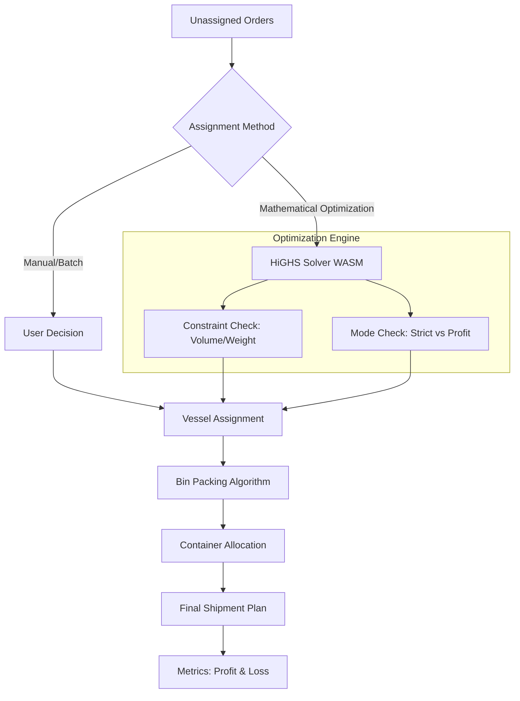
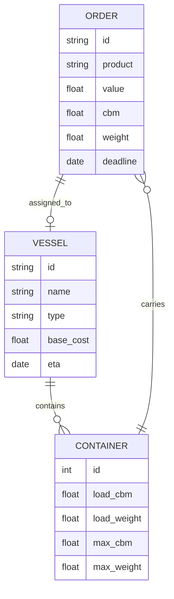

# ShipOpt - Shipping Optimization App

ShipOpt is an interactive web-based tool designed to optimize container shipping assignments. It balances shipping costs, delivery deadlines, and economic value using mathematical optimization.

## System Workflow



## Key Features

- **Mathematical Optimization**: Uses the HiGHS linear programming solver (WASM) to automatically assign orders to vessels.
- **Optimization Modes**:
    - **Strict Deadline**: Ensures all shipments arrive before their deadlines.
    - **Max Profit**: Allows minor delays (configurable) if it results in higher overall economic value, accounting for late delivery penalties.
- **Manual Control**: Supports manual and batch assignment of orders to specific vessels.
- **Visual Analytics**: 
    - Real-time tracking of total shipping costs and economic profit.
    - Detailed container utilization (volume and weight) visualizations.
    - Delay penalty calculations.
- **Responsive Design**: Mobile-friendly interface built with Tailwind CSS.

## Data Model



## Tech Stack

- **Frontend**: Vue.js 3 (Composition API)
- **Styling**: Tailwind CSS
- **Optimization Engine**: [highs.js](https://github.com/lovasoa/highs-js) (HiGHS solver compiled to WebAssembly)
- **Icons**: Font Awesome 6

## Getting Started

Since ShipOpt is a standalone single-page application, you can run it without any complex installation:

1. Clone the repository:
   ```bash
   git clone https://github.com/miumigy/shipopt.git
   ```
2. Open `index.html` in any modern web browser.

## Usage

1. **System Ready**: Wait for the "System Ready" indicator (the WASM solver needs a moment to load).
2. **Review Orders**: View the list of unassigned orders, including their value, volume, and weight.
3. **Run Optimization**: Click the **"Optimize"** button. The solver will automatically assign orders to the most cost-effective vessels based on the selected mode.
4. **Manual Adjustments**: 
   - Click an order to manually assign it to a vessel.
   - Use the checkboxes for batch assignment.
   - Drag/unassign items from the "Shipments" view if needed.
5. **Settings**: Adjust the number of generated orders or the allowed delay for profit-maximization mode via the gear icon.

## License

This project is open-source and available under the [MIT License](LICENSE).
